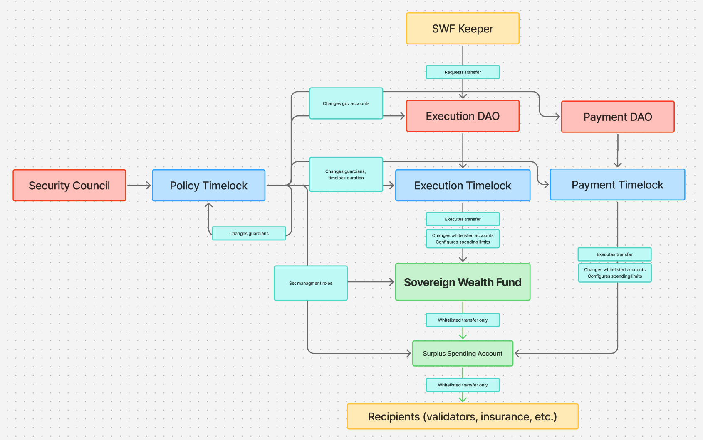

# House-of-Stake (HoS) treasury contracts

This repository contains the treasury smart contracts for the House-of-Stake (HoS) project. They are designed to hold a
large NEAR balance while limiting how quickly funds can leave, splitting control between DAOs and adding a mandatory
delay with a veto window to every action.

It contains the following contracts:

- **dao-timelock**: A timelock in front of a Sputnik DAO. The DAO schedules requests (batches of function calls) that
  can only be executed after a configurable delay. During the delay, a set of guardian accounts can cancel a request. It also supports scheduling a Sputnik proposal on the DAO it fronts: on execution it calls
  `add_proposal` and auto-approves the returned proposal id in a callback.
- **spending-account**: A treasury account that pays out NEAR and NEP-141 tokens only to whitelisted recipients, each
  capped by a spending limit (token limits are set per recipient-token pair). Control is split between a
  **spender** (can only transfer to whitelisted accounts within their remaining allowance) and an **admin** (manages
  the whitelist, limits and role assignments, but cannot transfer funds). Both roles are expected to be Sputnik DAOs
  acting through their own `dao-timelock`.

## Architecture

The intended deployment wires the contracts together like this:



- The **Sovereign Wealth Fund** (SWF) and the **Surplus Spending Account** (SSA) are both instances of the
  `spending-account` contract. The SWF holds the main treasury and can only transfer to whitelisted accounts — chiefly
  the SSA, which in turn can only transfer to whitelisted recipients (validators, insurance, etc.).
- The **Policy Timelock** and the **Execution Timelocks** are instances of the `dao-timelock` contract.
- The **Execution DAO** (acting on requests from the SWF Keeper) moves funds from the SWF through the
  **Execution Timelock SWF**; the **Payment DAO** pays recipients from the SSA through the
  **Execution Timelock SSA**.
- The **Policy DAO**, acting through the **Policy Timelock**, is the admin of both spending accounts: it manages the
  whitelist and spending limits, the governance account assignments, and the guardians and delay of every timelock —
  including its own.

Every fund movement therefore requires: a DAO vote, the timelock delay (during which guardians can cancel), and a
recipient that is already whitelisted with enough remaining allowance. Raising a limit or whitelisting a new
recipient goes through the same DAO-vote-plus-delay process on the policy side.

## Design principles

### Security

All contracts are designed to be deployed without access keys, to make sure the contract logic can't be affected.

- **dao-timelock**
  - Only the configured DAO can schedule requests. Anyone can execute a request once its delay has passed — the DAO
    already approved it at schedule time, and no guardian cancelled it during the delay.
  - A request is removed from storage before execution, so it can never run twice.
  - Guardians can only cancel pending requests; they cannot schedule, execute early, or change the configuration.
    Cancelling refunds the escrowed deposits to the funder.
  - Configuration changes (`set_dao`, `set_guardians`, `set_delay`) are callable only by the timelock account itself,
    so every change must go through a scheduled request and wait out the delay. The delay is capped at 366 days to
    protect against a typo bricking the DAO forever.
  - Action deposits are escrowed at schedule time: the attached deposit must equal the sum of the action deposits, and
    it is either attached on execution or refunded on cancellation.
- **spending-account**
  - The spender can do exactly one thing: transfer NEAR (or a NEP-141 token) to an already-whitelisted account within
    its remaining allowance. It cannot touch the whitelist or the limits.
  - Token transfers are whitelisted per (recipient, token) pair, each with its own limit in the token's
    smallest unit; being whitelisted for NEAR grants no token allowance and vice versa. The recipient must be
    registered with the token contract (NEP-145 storage deposit) — the contract does not pay storage deposits.
  - The admin manages the whitelist, the limits and the spender/admin role assignments, but cannot transfer
    funds directly.
  - A recipient's limit is its remaining allowance: transfers decrease it and it does not expire or reset. To grant
    a new allowance, the admin raises the recipient's limit.
  - The allowance is consumed before the transfer is sent; if the transfer fails (e.g. the receiver account was
    deleted, or is not registered with the token), a callback restores the limit so failed transfers do not
    consume the allowance.
  - The contract is intentionally NOT upgradable: there is no method to deploy code or migrate state.

### Events

Both contracts emit structured JSON events (NEP-297 style) for every state change: scheduling, execution and
cancellation of requests, configuration changes, whitelist changes, and transfers (including failed-transfer
rollbacks).

## Development

### Prerequisites

- Rust toolchain pinned by [`rust-toolchain.toml`](rust-toolchain.toml)
- [`cargo-near`](https://github.com/near/cargo-near) for building the WASM artifacts

### Building

To build all the contracts locally, run the following command:

```bash
./build_all.sh
```

The WASM artifacts are copied to `res/local/`.

### Testing

To test all the contracts locally, run the following command (note, it will build the contracts first):

```bash
./test_all.sh
```

This runs both the unit tests in each contract crate and the `near-workspaces` sandbox tests in
[`integration-tests/`](integration-tests/), which cover the timelock, the spending account (including NEP-141 token
transfers against a real token contract, `res/w_near.wasm`), and the full end-to-end flow through a real Sputnik DAO
(`res/sputnikdao2.wasm`).

### Building a release

To build reproducible release artifacts (output in `res/release/`):

```bash
./build_release.sh
```
